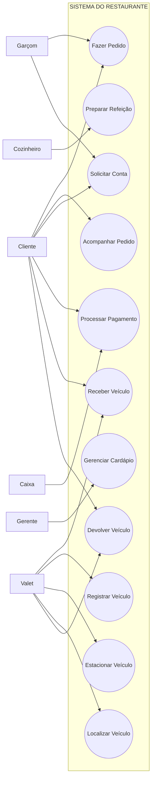
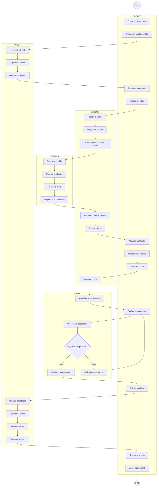

## Diagrama de Casos de Uso

```mermaid
flowchart LR

    Cliente["Cliente"]
    Garcom["Garçom"]
    Cozinheiro["Cozinheiro"]
    Caixa["Caixa"]
    Gerente["Gerente"]
    Valet["Valet"]

    subgraph Sistema["SISTEMA DO RESTAURANTE"]
        direction TB

        UC1(("Fazer Pedido"))
        UC2(("Acompanhar Pedido"))
        UC3(("Preparar Refeição"))
        UC4(("Solicitar Conta"))
        UC5(("Processar Pagamento"))
        UC6(("Gerenciar Cardápio"))
        UC7(("Receber Veículo"))
        UC8(("Registrar Veículo"))
        UC9(("Estacionar Veículo"))
        UC10(("Localizar Veículo"))
        UC11(("Devolver Veículo"))
    end

    Cliente --> UC1
    Cliente --> UC2
    Cliente --> UC4
    Cliente --> UC5
    Cliente --> UC7
    Cliente --> UC11

    Garcom --> UC1
    Garcom --> UC4

    Cozinheiro --> UC3
    Caixa --> UC5
    Gerente --> UC6

    Valet --> UC7
    Valet --> UC8
    Valet --> UC9
    Valet --> UC10
    Valet --> UC11
```

## Diagrama de Atividades

```mermaid
flowchart TB

    INICIO((INÍCIO))

    subgraph CLIENTE["CLIENTE"]
        C1["Chega ao restaurante"]
        C2["Entrega o veículo ao Valet"]
        C3["Entra no restaurante"]
        C4["Realiza o pedido"]
        C5["Aguarda a refeição"]
        C6["Consome a refeição"]
        C7["Solicita a conta"]
        C8["Realiza o pagamento"]
        C9["Solicita o veículo"]
        C10["Recebe o veículo"]
        C11["Sai do restaurante"]
    end

    subgraph VALET["VALET"]
        V1["Recebe o veículo"]
        V2["Registra o veículo"]
        V3["Estaciona o veículo"]
        V4["Aguarda solicitação"]
        V5["Localiza o veículo"]
        V6["Retira o veículo"]
        V7["Entrega o veículo"]
    end

    subgraph GARCOM["GARÇOM"]
        G1["Recebe o pedido"]
        G2["Registra o pedido"]
        G3["Envia o pedido para a cozinha"]
        G4["Recebe a refeição pronta"]
        G5["Serve o cliente"]
        G6["Entrega a conta"]
    end

    subgraph COZINHA["COZINHA"]
        K1["Recebe o pedido"]
        K2["Prepara a refeição"]
        K3["Finaliza o prato"]
        K4["Disponibiliza a refeição"]
    end

    subgraph CAIXA["CAIXA"]
        P1["Calcula o valor da conta"]
        P2["Processa o pagamento"]
        D1{"Pagamento aprovado?"}
        P3["Confirma o pagamento"]
        P4["Solicita nova tentativa"]
    end

    FIM((FIM))

    INICIO --> C1
    C1 --> C2
    C2 --> V1
    V1 --> V2
    V2 --> V3
    V3 --> C3

    C3 --> C4
    C4 --> G1
    G1 --> G2
    G2 --> G3
    G3 --> K1

    K1 --> K2
    K2 --> K3
    K3 --> K4
    K4 --> G4
    G4 --> G5
    G5 --> C5

    C5 --> C6
    C6 --> C7
    C7 --> G6
    G6 --> P1
    P1 --> C8
    C8 --> P2
    P2 --> D1

    D1 -->|Sim| P3
    D1 -->|Não| P4
    P4 --> C8

    P3 --> C9
    C9 --> V4
    V4 --> V5
    V5 --> V6
    V6 --> V7
    V7 --> C10
    C10 --> C11
    C11 --> FIM
```

