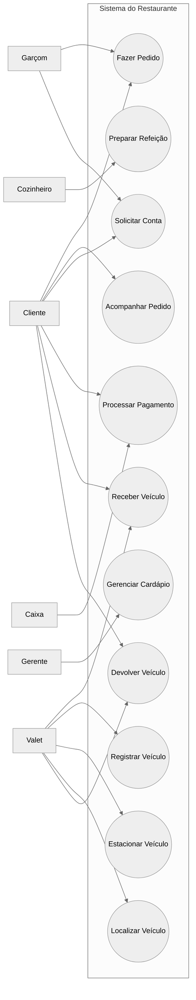
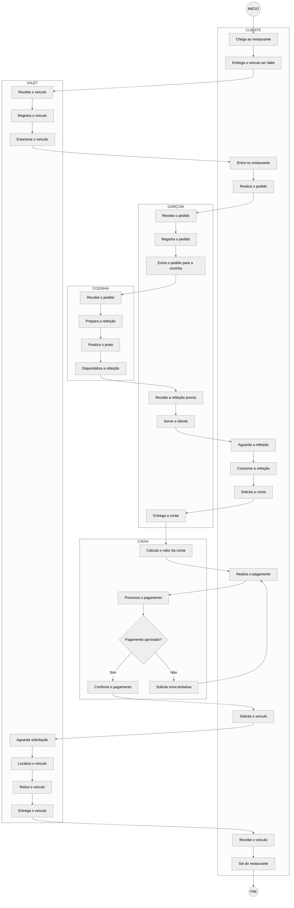

Diagramas do Sistema do Restaurante

## Diagrama de Casos de Uso

    
Descrição

O diagrama de casos de uso apresenta as principais interações entre os atores e o sistema do restaurante. Ele contempla o registro e acompanhamento de pedidos, preparação das refeições, solicitação e pagamento da conta, gerenciamento do cardápio e controle dos veículos no estacionamento.

Atores

- Cliente: realiza pedidos, acompanha o pedido, solicita a conta, realiza o pagamento e solicita o veículo.
- Garçom: registra os pedidos, encaminha-os para a cozinha e entrega a conta.
- Cozinheiro: recebe e prepara os pedidos.
- Caixa: processa e confirma os pagamentos.
- Gerente: gerencia o cardápio.
- Valet: recebe, registra, estaciona, localiza e devolve os veículos.

Condições

- O cliente deve estar associado a uma mesa ou atendimento.
- O cardápio deve estar atualizado e disponível.
- Os itens solicitados devem estar disponíveis.
- O sistema deve estar funcionando para registrar pedidos e pagamentos.

Fluxo Principal

- O cliente solicita o cardápio.
- O sistema apresenta os itens disponíveis.
- O cliente seleciona os itens e suas quantidades.
- O sistema registra o pedido e calcula o valor.
- O cliente confirma o pedido.
- O garçom registra e encaminha o pedido para a cozinha.
- A cozinha prepara a refeição.
- O garçom recebe e serve a refeição.
- O cliente solicita a conta.
- O sistema calcula o valor total.
- O cliente realiza o pagamento.
- O caixa processa o pagamento.
- O sistema confirma o pagamento e finaliza o atendimento.

Fluxos Alternativos

- Item indisponível: o sistema informa que o item está indisponível e solicita sua remoção ou substituição.
- Falha no pagamento: o sistema informa a falha e permite uma nova tentativa com outra forma de pagamento.
- Veículo não localizado: o Valet realiza uma nova consulta no registro do estacionamento.

Pós-condições

- O pedido fica registrado no sistema.
- A comanda da cozinha é gerada.
- O status do pedido é atualizado conforme seu andamento.
- O pagamento aprovado é registrado.
- O veículo é atualizado no sistema após sua devolução.

---

## Diagrama de Atividades

