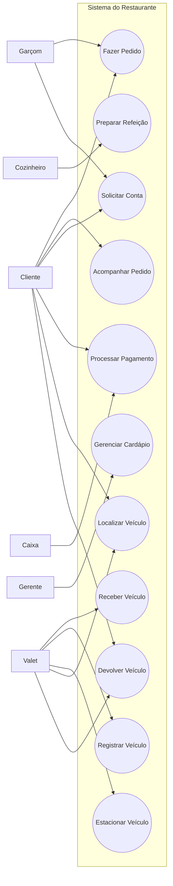

# Diagramas do Sistema do Restaurante

## 1. Diagrama de Atividades


---

## 2. Diagrama de Caso de Uso



---

## 3. Descrição do Caso de Uso

### Caso de Uso: Fazer Pedido

O caso de uso descreve o processo pelo qual o cliente seleciona os itens disponíveis no cardápio e realiza um pedido no sistema do restaurante.

### Atores

- **Cliente:** seleciona os itens, confirma o pedido e acompanha seu andamento.
- **Garçom:** registra o pedido e encaminha as informações para a cozinha.
- **Cozinheiro:** recebe o pedido e prepara a refeição.
- **Caixa:** processa o pagamento da conta.
- **Gerente:** gerencia os itens disponíveis no cardápio.
- **Valet:** recebe, registra, estaciona, localiza e devolve os veículos.

### Condições

- O cliente deve estar associado a uma mesa ou atendimento.
- O cardápio deve estar atualizado e disponível no sistema.
- Os itens solicitados devem estar disponíveis para preparo.
- O sistema deve estar funcionando corretamente.

### Fluxo Principal

1. O cliente solicita o cardápio.
2. O sistema apresenta os itens disponíveis.
3. O cliente seleciona os itens e suas respectivas quantidades.
4. O sistema registra os itens e calcula o valor total.
5. O cliente confirma o pedido.
6. O garçom registra o pedido.
7. O pedido é encaminhado para a cozinha.
8. A cozinha prepara a refeição.
9. O garçom recebe e serve a refeição ao cliente.
10. O cliente solicita a conta.
11. O sistema calcula o valor total da conta.
12. O cliente realiza o pagamento.
13. O caixa processa o pagamento.
14. O sistema confirma o pagamento e finaliza o atendimento.

### Fluxos Alternativos

- **FE01 - Item indisponível:** caso um item selecionado esteja indisponível, o sistema informa o cliente e solicita a remoção ou substituição do item antes da confirmação do pedido.

- **FE02 - Falha no pagamento:** caso o pagamento seja recusado, o sistema informa o cliente e permite uma nova tentativa utilizando outra forma de pagamento.

### Pós-condições

- O pedido é registrado no sistema.
- A comanda da cozinha é gerada.
- O status do pedido é atualizado conforme seu andamento.
- O pagamento aprovado é registrado no sistema.
- O atendimento é finalizado após a confirmação do pagamento.

## Execução

## Execução

1. Instalação:
```bash
cd /sdcard/
git clone https://github.com/SyntaxKiils/diagramas.git
cd diagramas
bash run.sh
